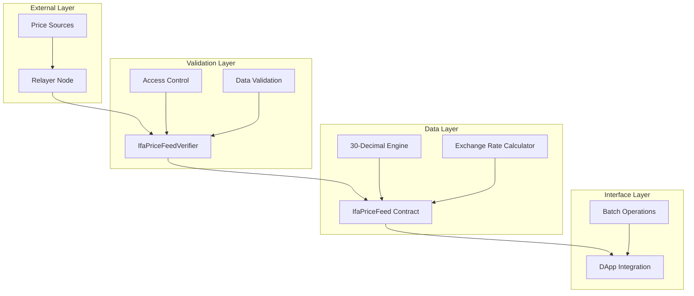
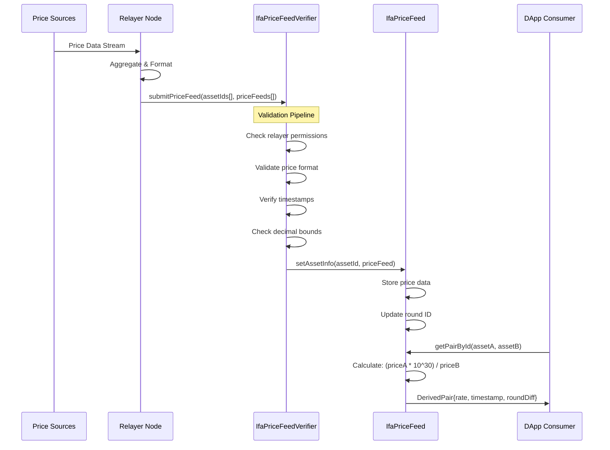
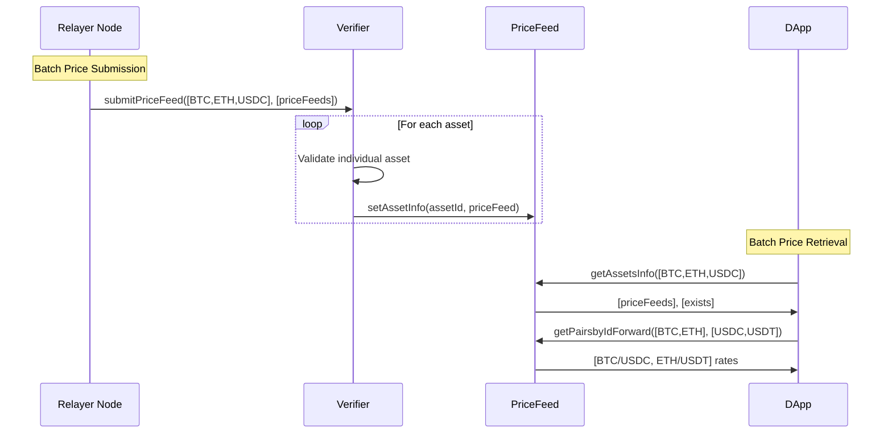
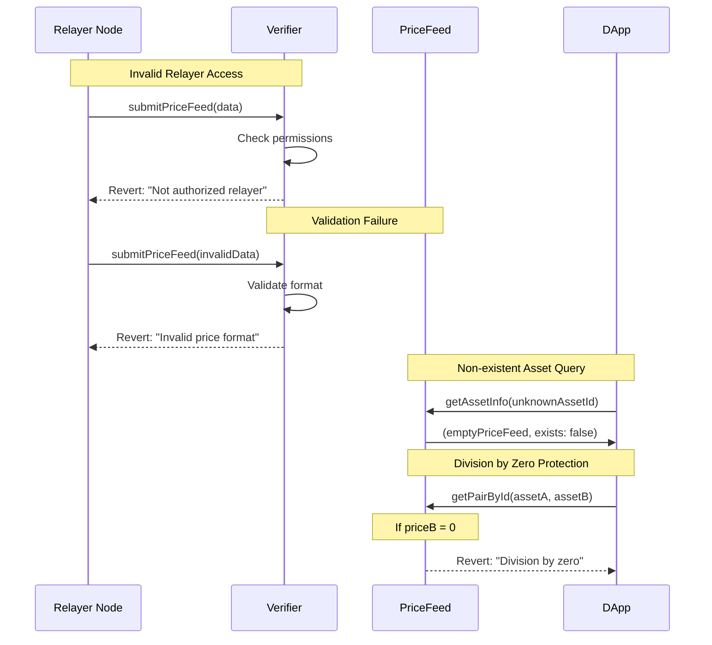
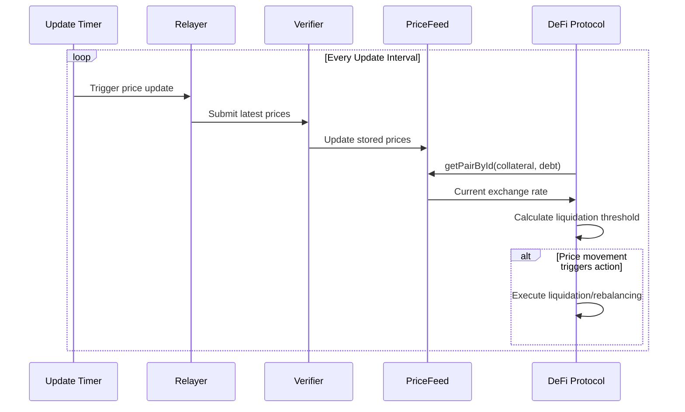

# Architecture

Multi-layered oracle architecture for reliable stablecoin price data with 30-decimal precision.

## System Layers



### 1. External Layer
- **Relayer Node**: Authorized price data collector with cryptographic validation
  - Role-based authentication via verifier contract
  - Batched submission capability for gas optimization
  - Replay attack protection through round IDs
- **Price Sources**: External market data providers and APIs
  - Multiple data source aggregation
  - Real-time price feed monitoring
  - Data integrity verification before submission

### 2. Validation Layer
- **IfaPriceFeedVerifier**: Multi-stage validation pipeline
  - **Access Control**: Relayer permission verification using role-based system
  - **Data Integrity**: Format validation, timestamp verification, and bounds checking
  - **Security Gates**: Protection against stale data, invalid precision, and malformed payloads
- **Validation Rules**:
  - Price values must be positive integers
  - Decimal precision within bounds (-30 to +30)
  - Timestamps must be recent (configurable staleness threshold)
  - Asset IDs must be valid keccak256 hashes

### 3. Data Layer
- **IfaPriceFeed Contract**: High-precision price storage and computation engine
  - **30-Decimal Engine**: Fixed-point arithmetic for maximum financial precision
    - All calculations scaled to 10^30 for consistent precision
    - Prevents rounding errors in exchange rate calculations
    - Supports micro-transactions and high-value operations
  - **Exchange Rate Calculator**: Real-time cross-asset rate computation
    - Forward/backward rate calculations: `Rate = (PriceA * 10^30) / PriceB`
    - Batch processing for multiple pairs simultaneously
    - Timestamp synchronization for consistent pricing
- **Storage Optimization**: 
  - Gas-efficient storage patterns
  - Minimal state changes for cost optimization

### 4. Interface Layer
- **IIfaPriceFeed Interface**: Standardized API with comprehensive functionality
  - Single asset queries: `getAssetInfo()`
  - Batch asset queries: `getAssetsInfo()`
  - Exchange rate calculations: `getPairById()`, `getPairsbyIdForward()`
- **Consumer Access**: Read-only functions optimized for DApp integration
  - **Batch Operations**: Retrieve multiple prices in single transaction
  - **Direction Control**: Forward/backward exchange rate calculations
  - **Error Handling**: Existence checks and validation responses

## Data Flow

### Normal Price Update Flow



### Batch Operations Flow



### Error Handling Flow



### Real-time Integration Pattern



## Exchange Rate Calculation

```
Rate = Price(Asset A) / Price(Asset B)
```

- USD-based pricing for all assets
- High precision decimal scaling
- Bidirectional calculations (A→B, B→A)
- Real-time rate updates


## Basic Integration

```solidity
// Get exchange rate
uint256 rate = priceFeed.getPairById(assetA, assetB);

// Get asset info
AssetInfo memory info = priceFeed.getAssetInfo(assetId);

// Batch operations
AssetInfo[] memory assets = priceFeed.getAssetsInfo(assetIds);
``` 