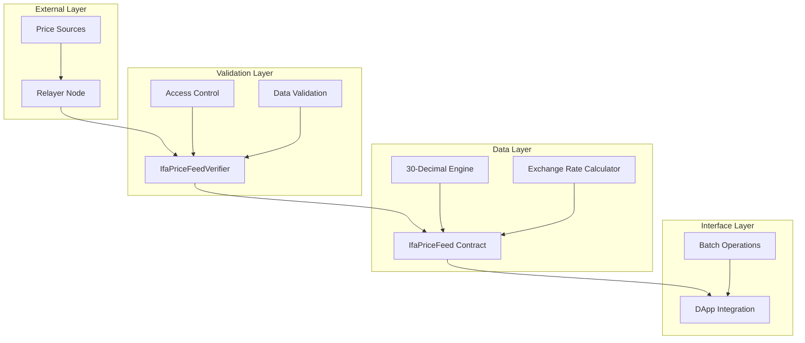
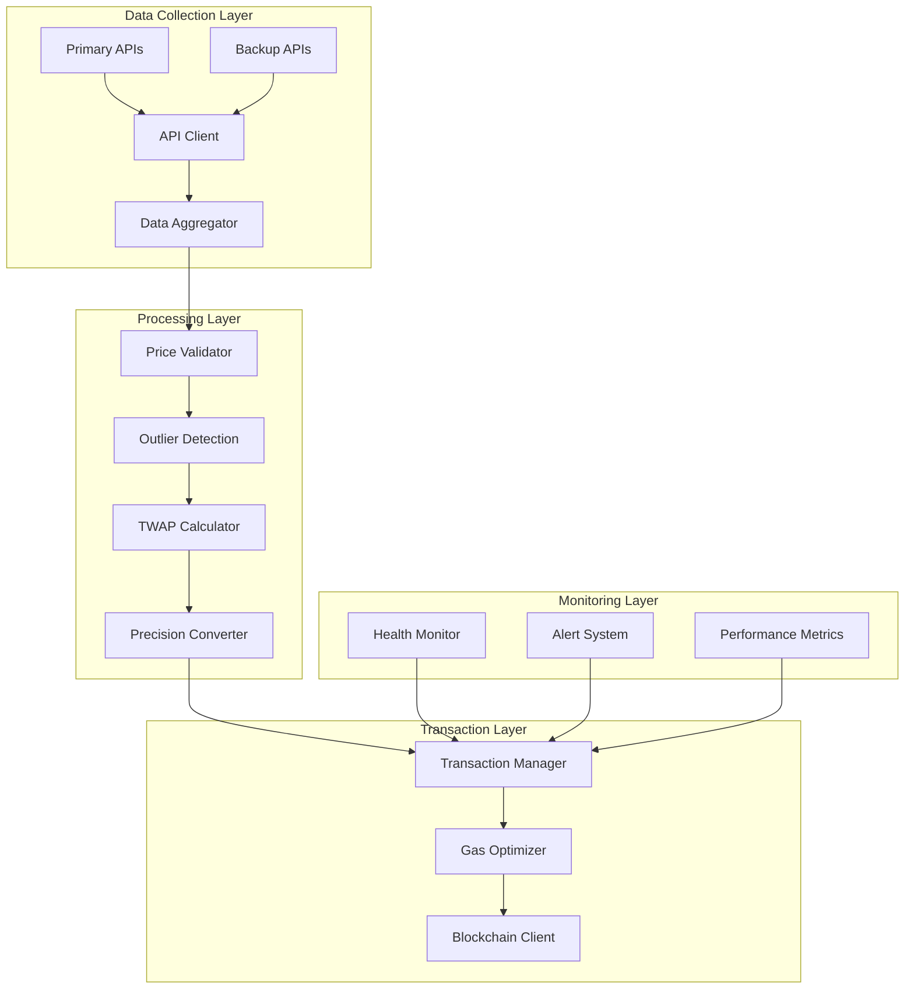
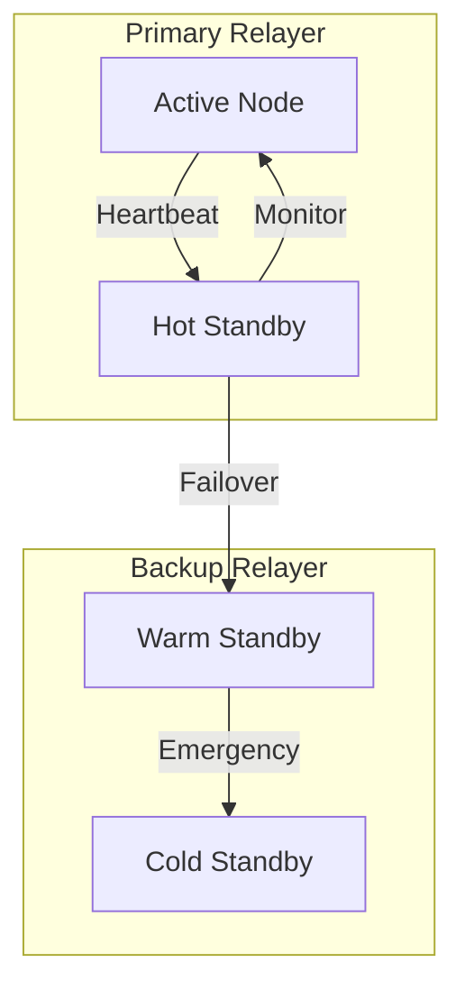
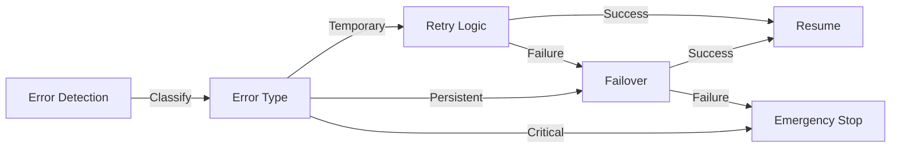
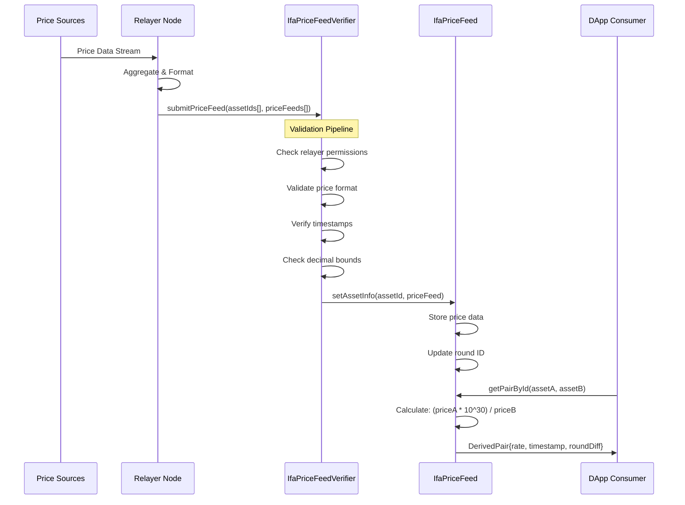
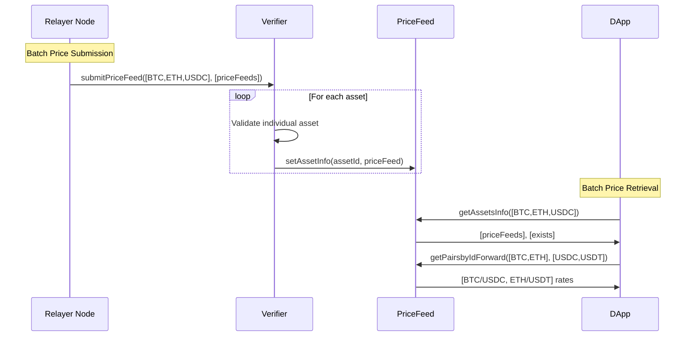
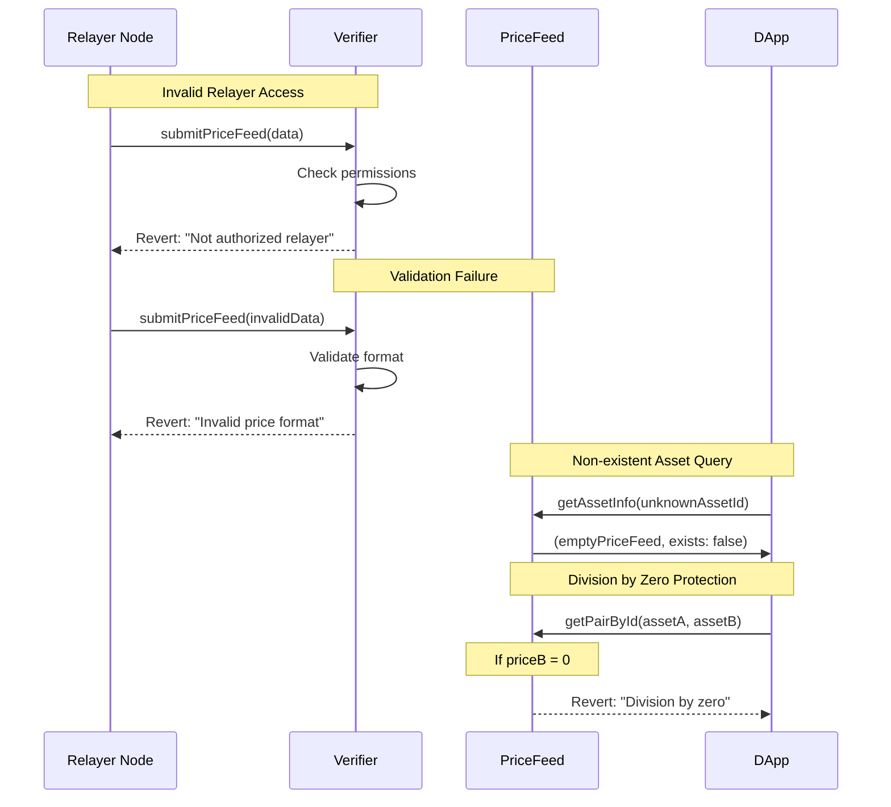
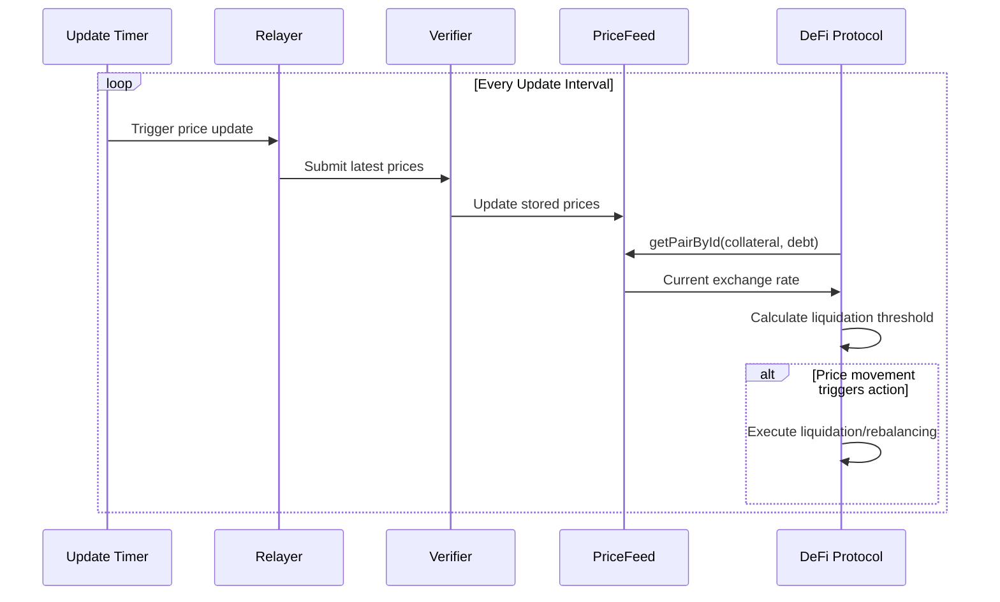

# Architecture

Multi-layered oracle architecture for reliable stablecoin price data with 30-decimal precision.

## System Layers



### 1. External Layer
- **Relayer Node**: Authorized price data collector with cryptographic validation
  - Role-based authentication via verifier contract
  - Batched submission capability for gas optimization
  - Replay attack protection through round IDs
- **Price Sources**: External market data providers and APIs
  - Multiple data source aggregation
  - Real-time price feed monitoring
  - Data integrity verification before submission

## Off-chain Relayer Architecture



### 1. Data Collection Layer
- **Primary Data Sources**
  - Direct exchange API connections
  - WebSocket price feeds
  - REST API endpoints
  - Configurable update frequencies
- **Backup Sources**
  - Secondary price aggregators
  - Fallback data providers
  - Automatic failover logic
- **Data Aggregator**
  - Connection pool management
  - Rate limiting compliance
  - Data normalization pipeline

### 2. Processing Layer
- **Price Validation**
  - Format verification
  - Range validation
  - Timestamp checks
  - Source reliability scoring
- **Outlier Detection**
  - Statistical analysis
  - Moving average comparisons
  - Volatility thresholds
  - Configurable deviation limits
- **TWAP Calculator**
  - Time-weighted average price
  - Configurable time windows
  - Volume-weighted options
- **Precision Converter**
  - 30-decimal conversion logic
  - Rounding rules
  - Overflow protection

### 3. Transaction Layer
- **Transaction Manager**
  - Queue management
  - Retry logic
  - Nonce tracking
  - Transaction signing
- **Gas Optimizer**
  - Dynamic gas pricing
  - EIP-1559 support
  - Priority fee estimation
  - Batch optimization
- **Blockchain Client**
  - Multiple RPC endpoints
  - Automatic node failover
  - Connection health monitoring
  - Transaction confirmation tracking

### 4. Monitoring Layer
- **Health Monitor**
  - Component status tracking
  - Resource utilization
  - Connection states
  - Processing pipeline metrics
- **Alert System**
  - Error notifications
  - Performance alerts
  - Price deviation warnings
  - Infrastructure alerts
- **Performance Metrics**
  - Response times
  - Update frequencies
  - Gas costs
  - Success rates

### Relayer High Availability


- **Active-Active Configuration**
  - Multiple relayer instances
  - Load balancing
  - Geographic distribution
  - Automatic failover
- **Backup Systems**
  - Hot standby nodes
  - Warm failover instances
  - Cold backup systems
  - Data synchronization

### Error Handling & Recovery


- **Error Classification**
  - Network issues
  - API failures
  - Data validation errors
  - Blockchain issues
- **Recovery Procedures**
  - Automatic retry logic
  - Circuit breakers
  - Fallback procedures
  - Manual intervention protocols

### Configuration Management
```yaml
relayer:
  primary_sources:
    - name: binance
      type: websocket
      priority: 1
      rate_limit: 100/minute
    - name: coinbase
      type: rest
      priority: 2
      rate_limit: 50/minute
  
  backup_sources:
    - name: coingecko
      type: rest
      priority: 3
    - name: coinmarketcap
      type: rest
      priority: 4

  validation:
    price_deviation_threshold: 2.5%
    minimum_sources: 3
    twap_window: 5minutes
    
  transaction:
    max_batch_size: 10
    retry_attempts: 3
    gas_premium: 10%
    confirmation_blocks: 2
    
  monitoring:
    heartbeat_interval: 30seconds
    alert_channels:
      - slack
      - email
      - pagerduty
```

### 2. Validation Layer
- **IfaPriceFeedVerifier**: Multi-stage validation pipeline
  - **Access Control**: Relayer permission verification using role-based system
  - **Data Integrity**: Format validation, timestamp verification, and bounds checking
  - **Security Gates**: Protection against stale data, invalid precision, and malformed payloads
- **Validation Rules**:
  - Price values must be positive integers
  - Decimal precision within bounds (-30 to +30)
  - Timestamps must be recent (configurable staleness threshold)
  - Asset IDs must be valid keccak256 hashes

### 3. Data Layer
- **IfaPriceFeed Contract**: High-precision price storage and computation engine
  - **30-Decimal Engine**: Fixed-point arithmetic for maximum financial precision
    - All calculations scaled to 10^30 for consistent precision
    - Prevents rounding errors in exchange rate calculations
    - Supports micro-transactions and high-value operations
  - **Exchange Rate Calculator**: Real-time cross-asset rate computation
    - Forward/backward rate calculations: `Rate = (PriceA * 10^30) / PriceB`
    - Batch processing for multiple pairs simultaneously
    - Timestamp synchronization for consistent pricing
- **Storage Optimization**: 
  - Gas-efficient storage patterns
  - Minimal state changes for cost optimization

### 4. Interface Layer
- **IIfaPriceFeed Interface**: Standardized API with comprehensive functionality
  - Single asset queries: `getAssetInfo()`
  - Batch asset queries: `getAssetsInfo()`
  - Exchange rate calculations: `getPairById()`, `getPairsbyIdForward()`
- **Consumer Access**: Read-only functions optimized for DApp integration
  - **Batch Operations**: Retrieve multiple prices in single transaction
  - **Direction Control**: Forward/backward exchange rate calculations
  - **Error Handling**: Existence checks and validation responses

## Data Flow

### Normal Price Update Flow



### Batch Operations Flow



### Error Handling Flow



### Real-time Integration Pattern



## Exchange Rate Calculation

```
Rate = Price(Asset A) / Price(Asset B)
```

- USD-based pricing for all assets
- High precision decimal scaling
- Bidirectional calculations (A→B, B→A)
- Real-time rate updates


## Basic Integration

```solidity
// Get exchange rate
uint256 rate = priceFeed.getPairById(assetA, assetB);

// Get asset info
AssetInfo memory info = priceFeed.getAssetInfo(assetId);

// Batch operations
AssetInfo[] memory assets = priceFeed.getAssetsInfo(assetIds);
``` 