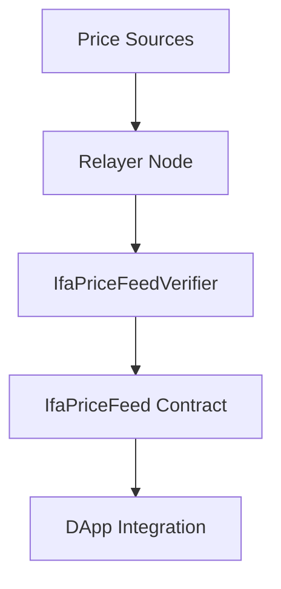
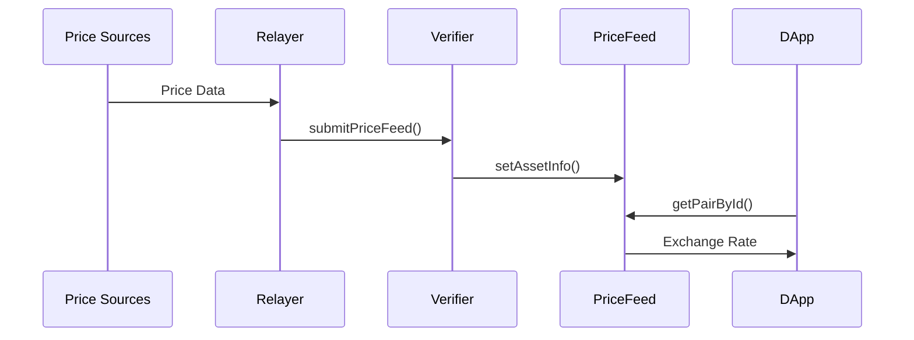

# Architecture

Multi-layered oracle architecture for reliable stablecoin price data.

## System Layers



### 1. External Layer
- **Relayer Node**: Collects price data from external sources
- **Price Sources**: Market data providers and APIs

### 2. Validation Layer
- **IfaPriceFeedVerifier**: Validates incoming price data
- **Access Control**: Role-based permissions
- **Data Integrity**: Format and authenticity checks

### 3. Data Layer
- **IfaPriceFeed Contract**: Stores validated price data
- **Exchange Rate Engine**: Real-time pair calculations
- **Storage**: High precision price data (30 decimals)

### 4. Interface Layer
- **IIfaPriceFeed Interface**: Standardized API
- **Consumer Access**: Read functions for DApps

## Data Flow



## Security Model

### Access Control
- **Owner**: Full administrative control
- **Verifier**: Can update price data
- **Relayer**: Submits data through verifier
- **Users**: Read-only access

### Security Features
- Role-based permissions
- Data format validation
- Timestamp verification
- Replay attack prevention

## Exchange Rate Calculation

```
Rate = Price(Asset A) / Price(Asset B)
```

- USD-based pricing for all assets
- High precision decimal scaling
- Bidirectional calculations (A→B, B→A)
- Real-time rate updates

## Integration

```solidity
// Get exchange rate
uint256 rate = priceFeed.getPairById(assetA, assetB);

// Get asset info
AssetInfo memory info = priceFeed.getAssetInfo(assetId);

// Batch operations
AssetInfo[] memory assets = priceFeed.getAssetsInfo(assetIds);
``` 