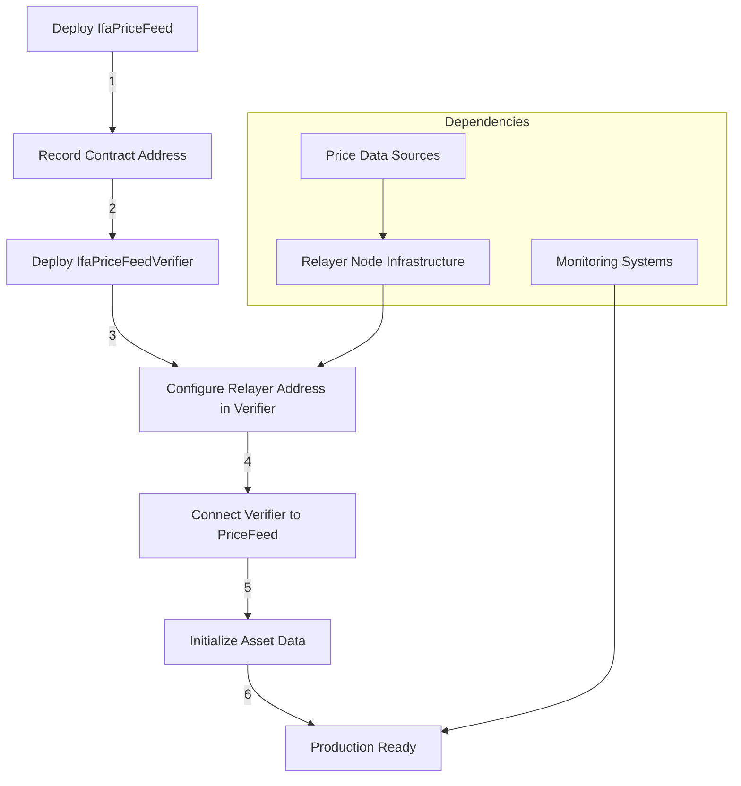
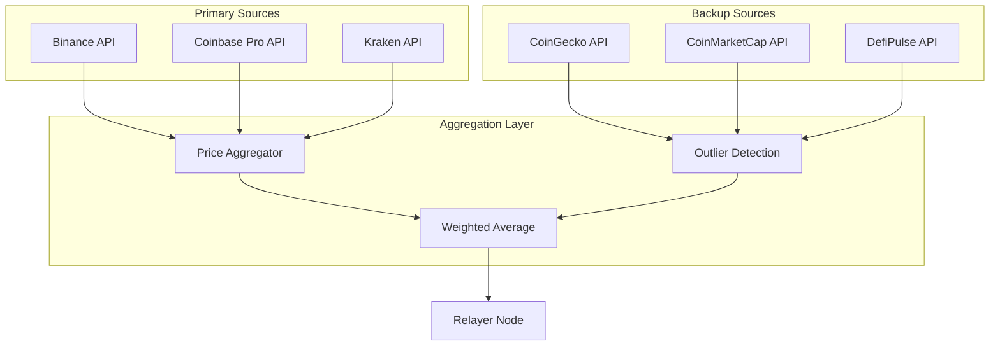
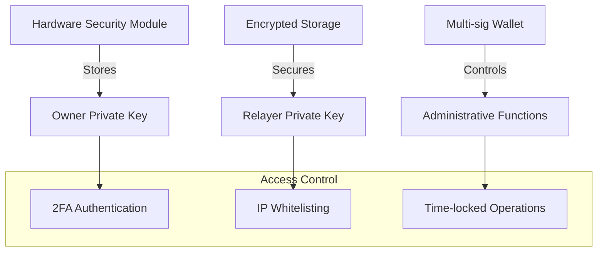

## Contract Deployment Flow



## Multi-Network Deployment

### Network Configuration Matrix

| Network | Gas Costs | Block Time | Recommended Update Frequency |
|---------|-----------|------------|------------------------------|
| **Ethereum Mainnet** | High (~$10-50) | 12s | 5-15 minutes |
| **Polygon** | Low (~$0.01-0.10) | 2s | 1-2 minutes |
| **Arbitrum** | Medium (~$0.50-2) | ~1s | 30-60 seconds |
| **Optimism** | Medium (~$0.50-2) | 2s | 30-60 seconds |
| **BSC** | Low (~$0.10-0.50) | 3s | 1-2 minutes |

### Cross-chain Deployment Strategy
```solidity
// Network-specific configuration
struct NetworkConfig {
    uint256 updateFrequency;     // Seconds between updates
    uint256 maxStaleness;        // Maximum acceptable data age
    uint256 gasOptimization;     // Batch size for gas efficiency
    address relayerNode;         // Network-specific relayer
}

mapping(uint256 => NetworkConfig) public networkConfigs;
```

## Infrastructure Requirements

### Relayer Node Specifications
**Minimum Requirements:**
- **CPU**: 2 cores, 2.5GHz+
- **RAM**: 4GB minimum, 8GB recommended
- **Storage**: 100GB SSD
- **Network**: Stable internet, low latency to RPC endpoints
- **Uptime**: 99.5%+ availability required

**Recommended Production Setup:**
- **CPU**: 4+ cores, 3.0GHz+
- **RAM**: 16GB+
- **Storage**: 500GB NVMe SSD
- **Network**: Redundant connections, multiple RPC providers
- **Uptime**: 99.9%+ with failover capabilities

### Price Data Sources


## Operational Monitoring

### Critical Metrics Dashboard
```
Price Update Frequency:     Target vs Actual intervals
Data Source Availability:   % uptime per source
Validation Success Rate:    % successful submissions  
Gas Cost Tracking:         USD cost per update
Network Congestion:         Current gas prices
Asset Coverage:             Number of supported assets
Consumer Health:           Active integrations status
```

### Alert Thresholds
```yaml
Critical Alerts:
  - Price updates stopped > 5 minutes
  - Relayer node offline > 2 minutes
  - Validation failure rate > 5%
  - Price deviation > 10% from external sources

Warning Alerts:
  - Update frequency below target
  - High gas cost environment
  - Single data source failure
  - Consumer integration errors
```

## Security Operations

### Key Management


### Incident Response Procedures
1. **Price Feed Anomaly Detection**
   - Automated circuit breakers
   - Manual override capabilities
   - Stakeholder notification protocols

2. **Relayer Compromise Response**
   - Immediate relayer address rotation
   - Historical data validation
   - System integrity verification

3. **Network Congestion Handling**
   - Dynamic gas price adjustment
   - Priority transaction batching
   - Alternative network failover

## Upgrade & Maintenance

### Contract Upgradeability
The IFA Oracle follows an immutable contract design with configurable components:

```solidity
// Non-upgradeable core logic (immutable)
contract IfaPriceFeed { ... }

// Configurable validation logic  
contract IfaPriceFeedVerifier { 
    function setRelayerNode(address newRelayer) external onlyOwner;
}

// Operational parameters
contract OracleConfig {
    uint256 public maxStaleness;
    uint256 public updateFrequency;
    mapping(bytes32 => bool) public supportedAssets;
}
```

### Maintenance Windows
- **Regular Maintenance**: Weekly during low-usage periods
- **Emergency Maintenance**: Immediate response capability
- **Planned Upgrades**: 48-hour advance notice to integrators
- **Network Upgrades**: Coordination with blockchain network upgrades

### Backup & Recovery
```
Data Backup Strategy:
  - Real-time price data archival
  - Contract state snapshots
  - Configuration backups
  - Event log preservation

Recovery Procedures:
  - Relayer node failover (< 30 seconds)
  - Data source switching (< 60 seconds)  
  - Network migration (planned maintenance)
  - Emergency pause capability
```