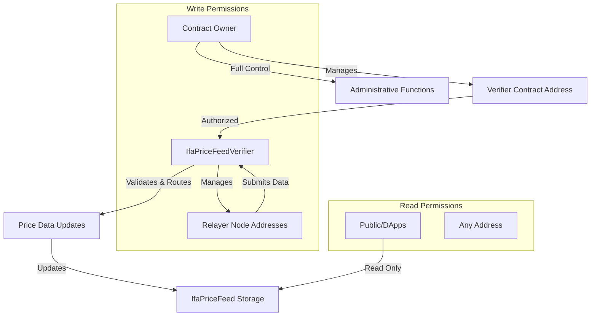

## Role Hierarchy & Permissions



## Permission Matrix

| Role | Contract | Function Access | Purpose |
|------|----------|----------------|---------|
| **Owner** | IfaPriceFeed | `setVerifier()`, `transferOwnership()` | Administrative control |
| **Owner** | IfaPriceFeedVerifier | `setRelayerNode()`, `transferOwnership()` | Relayer management |
| **Verifier Contract** | IfaPriceFeed | `setAssetInfo()` | Price data updates |
| **Relayer Node** | IfaPriceFeedVerifier | `submitPriceFeed()` | Price submission |
| **Public** | IfaPriceFeed | `getAssetInfo()`, `getPairById()`, etc. | Read operations |

## Security Features

### Access Control Protection
- **Two-level Authorization**: Owner → Verifier → Relayer chain prevents single point of failure
- **Role Separation**: Clear separation between administrative, validation, and data submission roles
- **Address Verification**: Cryptographic verification of caller addresses at each level

### Data Integrity Safeguards
- **Input Validation**: Multi-layer validation pipeline prevents malformed data injection
- **Timestamp Verification**: Protection against stale data and replay attacks
- **Decimal Bounds Checking**: Prevents overflow/underflow in precision calculations
- **Existence Validation**: Asset existence checks prevent undefined behavior

### Operational Security
- **Round ID Tracking**: Prevents replay attacks and ensures data freshness
- **Batch Atomicity**: All-or-nothing batch operations prevent partial state corruption
- **Zero Division Protection**: Mathematical safeguards prevent calculation errors
- **Gas Limit Considerations**: Function design prevents DoS through gas exhaustion

## Trust Model & Assumptions

### Trust Requirements
1. **Relayer Node Integrity**: Trusted to provide accurate, timely price data
2. **Owner Responsibility**: Trusted to manage verifier and relayer assignments appropriately
3. **Network Security**: Depends on underlying blockchain consensus and finality

### Attack Vector Analysis

**High Risk Mitigated:**
- ✅ **Unauthorized Price Updates**: Prevented by multi-layer access control
- ✅ **Price Manipulation**: Limited to authorized relayer with validation pipeline
- ✅ **Replay Attacks**: Prevented by round ID tracking and timestamp validation
- ✅ **Data Corruption**: Prevented by input validation and atomic operations

**Medium Risk Monitored:**
- ⚠️ **Relayer Compromise**: Single relayer failure impacts data freshness
- ⚠️ **Oracle Front-running**: Price updates visible before block confirmation
- ⚠️ **Network Congestion**: May delay price updates during high network load

**Low Risk Accepted:**
- ℹ️ **MEV Extraction**: Read-only oracle data may enable MEV opportunities
- ℹ️ **Gas Price Volatility**: May affect update frequency economics

## Security Best Practices for Integrators

### Safe Integration Patterns
```solidity
// Always check asset existence
(PriceFeed memory price, bool exists) = oracle.getAssetInfo(assetId);
require(exists, "Asset not supported");

// Validate data freshness
require(block.timestamp - price.lastUpdateTime <= MAX_STALENESS, "Price too old");

// Handle potential zero prices
require(price.price > 0, "Invalid price data");

// Use appropriate precision scaling
uint256 scaledPrice = price.price * (10 ** targetDecimals) / (10 ** uint256(price.decimal));
```

### Circuit Breaker Integration
```solidity
// Implement price change limits
uint256 priceChangePercent = abs(newPrice - lastPrice) * 100 / lastPrice;
require(priceChangePercent <= MAX_PRICE_CHANGE, "Price change too large");

// Implement emergency pause capability
require(!emergencyPaused, "Oracle emergency pause active");
```