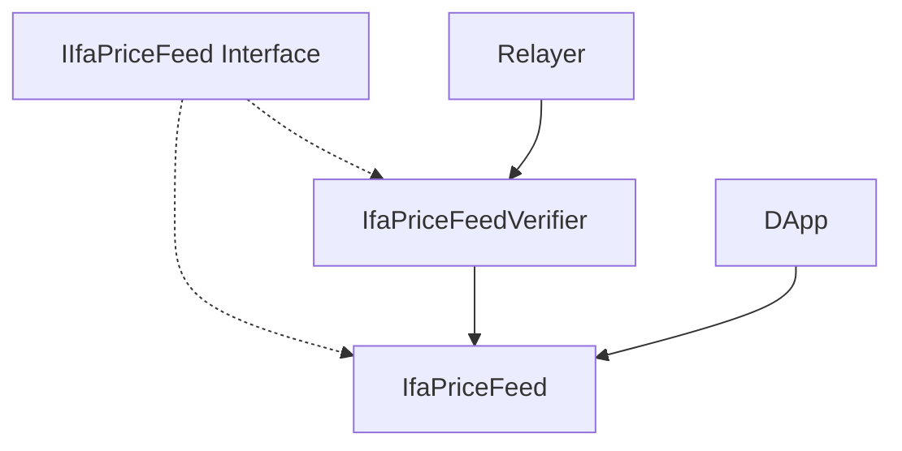
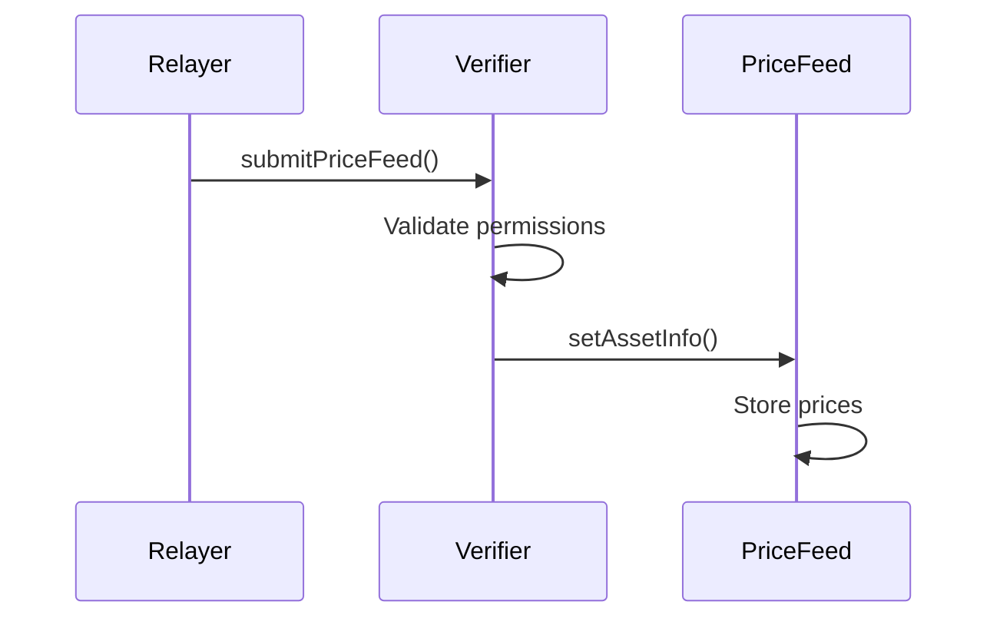

# Contracts Overview

Three main contracts compose the IFA Oracle Price Feed System.

## Contract Architecture



## Contracts

### 1. IIfaPriceFeed (Interface)
- **Purpose**: Standard interface and data structures
- **Location**: `src/IIfaPriceFeed.sol`

**Key Structures:**
```solidity
struct PriceFeed {
    int256 decimal;          // Precision (-30 to 30)
    uint256 lastUpdateTime;  // Last update timestamp
    uint256 price;           // Price with decimal scaling
    uint256 roundId;         // Round tracking
}

enum PairDirection { Forward, Backward }
```

### 2. IfaPriceFeed (Main Contract)
- **Purpose**: Price storage and exchange rate calculations
- **Location**: `src/IfaPriceFeed.sol`

**Key Features:**
- 30-decimal precision price storage
- Real-time exchange rate calculations  
- Batch operations support
- Access control for updates

**Core Functions:**
```solidity
function setAssetInfo(bytes32 assetId, PriceFeed memory priceFeed)
function getAssetInfo(bytes32 assetId) returns (PriceFeed memory, bool)
function getPairById(bytes32 asset0, bytes32 asset1) returns (DerivedPair memory)
```

### 3. IfaPriceFeedVerifier (Validation Contract)
- **Purpose**: Price data validation and routing
- **Location**: `src/IfaPriceFeedVerifier.sol`

**Key Features:**
- Relayer permission management
- Price data validation
- Secure routing to main contract

**Core Functions:**
```solidity
function submitPriceFeed(bytes32[] calldata assetIds, PriceFeed[] calldata priceFeeds)
function setRelayerNode(address relayerNode)
```

## Contract Interaction Flow



## Deployment Order

1. Deploy `IfaPriceFeed`
2. Deploy `IfaPriceFeedVerifier` with relayer address
3. Connect verifier to price feed: `priceFeed.setVerifier(verifier)`

## Access Control

- **Owner**: Full administrative control
- **Verifier Contract**: Can update prices in main contract
- **Relayer Node**: Can submit data through verifier
- **Public**: Read-only access to price data 