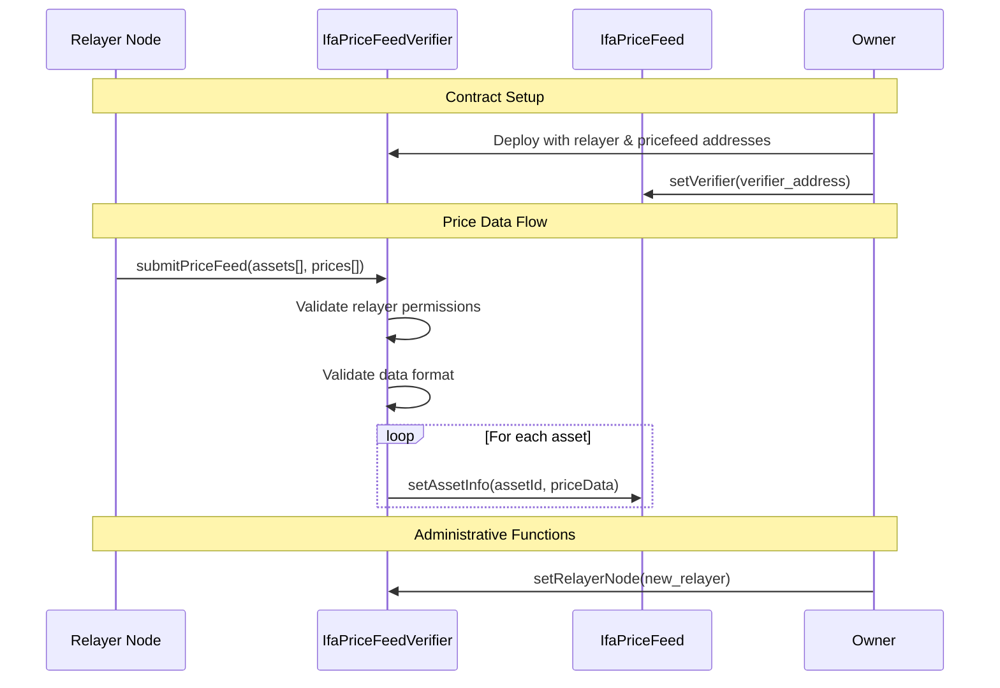
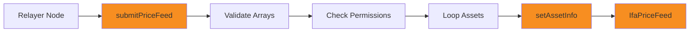

# IfaPriceFeedVerifier Contract

The `IfaPriceFeedVerifier` contract serves as the validation and security layer for price data submissions in the IFA Oracle Price Feed System. It validates incoming data from relayer nodes and forwards approved updates to the main price feed contract.

## Contract Overview

- **Contract Name**: `IfaPriceFeedVerifier`
- **Location**: `src/IfaPriceFeedVerifier.sol`
- **Role**: Validation and access control layer
- **Access Control**: Owner and relayer-based permissions

## Architecture Position



## State Variables

### Core Configuration

```solidity
address public relayerNode;     // Authorized relayer address
address public priceFeed;       // Target price feed contract
address public owner;           // Contract owner
```

- `relayerNode`: Only this address can submit price data
- `priceFeed`: The IfaPriceFeed contract to update
- `owner`: Administrative control over the verifier

## Constructor

```solidity
constructor(address _relayerNode, address _priceFeed)
```

**Purpose**: Initialize the verifier with relayer and price feed addresses

**Parameters**:
- `_relayerNode`: Address authorized to submit price data
- `_priceFeed`: Address of the IfaPriceFeed contract to update

**Example Usage**:
```solidity
// Deploy price feed first
IfaPriceFeed priceFeed = new IfaPriceFeed();

// Deploy verifier with relayer and price feed
IfaPriceFeedVerifier verifier = new IfaPriceFeedVerifier(
    0x1234567890123456789012345678901234567890, // relayer address
    address(priceFeed)
);

// Link verifier to price feed
priceFeed.setVerifier(address(verifier));
```

## Function Reference

### Core Functions

#### submitPriceFeed

```solidity
function submitPriceFeed(
    bytes32[] calldata _assetindex,
    IIfaPriceFeed.PriceFeed[] calldata _prices
) external
```

**Purpose**: Submit new price data for multiple assets

**Access Control**: Only callable by the designated relayer node

**Parameters**:
- `_assetindex`: Array of asset identifiers (keccak256 hashes)
- `_prices`: Array of PriceFeed structs with price data

**Requirements**:
- Caller must be the authorized relayer node
- Both arrays must have the same length
- Arrays cannot be empty

**Gas Cost**: ~50,000 + (30,000 * number of assets) gas

**Validation Process**:
1. Verify caller is the authorized relayer node
2. Check array lengths match and are non-zero
3. Call `setAssetInfo` on price feed for each asset
4. Forward any errors from the price feed contract

**Example Usage**:
```solidity
// Prepare asset data
bytes32[] memory assetIndexes = new bytes32[](2);
assetIndexes[0] = keccak256("BTC");
assetIndexes[1] = keccak256("ETH");

IIfaPriceFeed.PriceFeed[] memory prices = new IIfaPriceFeed.PriceFeed[](2);

// BTC price: $45,000.12345678 (8 decimals)
prices[0] = IIfaPriceFeed.PriceFeed({
    decimal: -8,
    lastUpdateTime: block.timestamp,
    price: 4500012345678,
    roundId: 157
});

// ETH price: $3,200.56789012 (8 decimals)  
prices[1] = IIfaPriceFeed.PriceFeed({
    decimal: -8,
    lastUpdateTime: block.timestamp,
    price: 320056789012,
    roundId: 98
});

// Submit to verifier (only relayer can call)
verifier.submitPriceFeed(assetIndexes, prices);
```

### Administrative Functions

#### setRelayerNode

```solidity
function setRelayerNode(address _relayerNode) external
```

**Purpose**: Update the authorized relayer node address

**Access Control**: Only callable by the contract owner

**Parameters**:
- `_relayerNode`: New relayer node address

**Gas Cost**: ~25,000 gas

**Security Considerations**:
- Critical function that controls price data access
- Should be used with extreme caution
- Consider implementing timelock delays for production

**Example Usage**:
```solidity
// Owner updates relayer node
verifier.setRelayerNode(0x9876543210987654321098765432109876543210);

// Verify the change
address newRelayer = verifier.relayerNode();
```

## Security Model

### Access Control Matrix

| Function | Owner | Relayer | Anyone |
|----------|-------|---------|--------|
| `submitPriceFeed` | ❌ | ✅ | ❌ |
| `setRelayerNode` | ✅ | ❌ | ❌ |
| View relayerNode | ✅ | ✅ | ✅ |
| View priceFeed | ✅ | ✅ | ✅ |
| View owner | ✅ | ✅ | ✅ |

### Security Features

**Role Separation**:
- Owner controls configuration but cannot submit price data
- Relayer can only submit data, no administrative control
- Clear separation of concerns reduces attack surface

**Input Validation**:
- Array length validation prevents mismatched data
- Empty array rejection prevents gas waste
- Relayer authentication on every submission

**Error Propagation**:
- Forwards validation errors from price feed contract
- Maintains transaction atomicity across multiple asset updates
- Preserves error context for debugging

## Integration with Price Feed

### Data Flow Architecture



### Batch Processing Logic

The verifier processes multiple assets atomically:

```solidity
// Pseudo-code for batch processing
function submitPriceFeed(bytes32[] calldata assets, PriceFeed[] calldata prices) {
    // 1. Validate caller
    require(msg.sender == relayerNode, "Unauthorized");
    
    // 2. Validate input arrays
    require(assets.length == prices.length, "Array mismatch");
    require(assets.length > 0, "Empty arrays");
    
    // 3. Process each asset atomically
    for (uint i = 0; i < assets.length; i++) {
        IIfaPriceFeed(priceFeed).setAssetInfo(assets[i], prices[i]);
        // If any setAssetInfo fails, entire transaction reverts
    }
}
```

## Error Handling

### Common Error Conditions

1. **Unauthorized Access**: Non-relayer attempting to submit data
2. **Array Length Mismatch**: Different array sizes for assets and prices
3. **Empty Arrays**: Submitting zero-length arrays
4. **Price Feed Errors**: Underlying contract rejecting data

### Error Messages

| Error | Condition | Solution |
|-------|-----------|----------|
| "Only relayer can submit" | Wrong caller | Use authorized relayer address |
| "Array length mismatch" | Different array sizes | Ensure equal length arrays |
| "Arrays cannot be empty" | Zero-length arrays | Submit at least one asset |
| Forwarded errors | Price feed rejection | Check price data validity |

### Error Handling Examples

```solidity
// Example: Handling unauthorized access
try verifier.submitPriceFeed(assets, prices) {
    // Success
} catch Error(string memory reason) {
    if (keccak256(bytes(reason)) == keccak256("Only relayer can submit")) {
        // Handle unauthorized access
        revert("Wrong relayer address");
    }
}

// Example: Input validation
require(assets.length == prices.length, "Arrays must be same length");
require(assets.length > 0, "Must submit at least one asset");
```

## Deployment Patterns

### Standard Deployment Flow

```solidity
// 1. Deploy main price feed contract
IfaPriceFeed priceFeed = new IfaPriceFeed();

// 2. Deploy verifier with relayer and price feed addresses
IfaPriceFeedVerifier verifier = new IfaPriceFeedVerifier(
    relayerNodeAddress,
    address(priceFeed)
);

// 3. Authorize verifier in price feed
priceFeed.setVerifier(address(verifier));

// 4. Verify setup
assert(priceFeed.verifier() == address(verifier));
assert(verifier.priceFeed() == address(priceFeed));
assert(verifier.relayerNode() == relayerNodeAddress);
```

### Multi-Verifier Architecture

For advanced setups, multiple verifiers can be deployed:

```solidity
// Deploy multiple verifiers for different relayer nodes
IfaPriceFeedVerifier verifier1 = new IfaPriceFeedVerifier(
    relayer1Address,
    address(priceFeed)
);

IfaPriceFeedVerifier verifier2 = new IfaPriceFeedVerifier(
    relayer2Address,
    address(priceFeed)
);

// Note: Only one verifier can be active in price feed at a time
// Switch between verifiers using priceFeed.setVerifier()
```

## Gas Optimization

### Batch Submission Benefits

The verifier's batch processing provides significant gas savings:

| Assets | Individual Calls | Batch Call | Savings |
|--------|------------------|------------|---------|
| 1 | ~50,000 gas | ~50,000 gas | 0% |
| 5 | ~250,000 gas | ~180,000 gas | ~28% |
| 10 | ~500,000 gas | ~330,000 gas | ~34% |

### Optimization Tips

**For Relayer Operators**:
```solidity
// Efficient: Batch multiple assets
bytes32[] memory assets = [btcId, ethId, usdcId, usdtId];
PriceFeed[] memory prices = [btcPrice, ethPrice, usdcPrice, usdtPrice];
verifier.submitPriceFeed(assets, prices);

// Inefficient: Individual submissions
verifier.submitPriceFeed([btcId], [btcPrice]);
verifier.submitPriceFeed([ethId], [ethPrice]);
verifier.submitPriceFeed([usdcId], [usdcPrice]);
verifier.submitPriceFeed([usdtId], [usdtPrice]);
```

**Array Pre-allocation**:
```solidity
// Pre-allocate arrays for better gas efficiency
uint256 assetCount = getAssetCount();
bytes32[] memory assets = new bytes32[](assetCount);
PriceFeed[] memory prices = new PriceFeed[](assetCount);

// Populate arrays efficiently
for (uint i = 0; i < assetCount; i++) {
    assets[i] = getAssetId(i);
    prices[i] = getPriceData(i);
}
```

## Monitoring and Maintenance

### Event Logging Recommendations

While the current contract doesn't emit events, integrators should monitor:

```solidity
// Monitor successful price submissions
interface IMonitoring {
    event PriceSubmitted(bytes32 indexed asset, uint256 price, uint256 timestamp);
    event BatchSubmitted(uint256 assetCount, address relayer);
    event RelayerChanged(address oldRelayer, address newRelayer);
}
```

### Health Checks

```solidity
contract VerifierHealthCheck {
    IfaPriceFeedVerifier public verifier;
    
    function checkConfiguration() external view returns (bool healthy) {
        // Verify relayer is set
        if (verifier.relayerNode() == address(0)) return false;
        
        // Verify price feed is set
        if (verifier.priceFeed() == address(0)) return false;
        
        // Verify owner is set
        if (verifier.owner() == address(0)) return false;
        
        return true;
    }
    
    function checkPermissions() external view returns (bool properly_linked) {
        IfaPriceFeed priceFeed = IfaPriceFeed(verifier.priceFeed());
        return priceFeed.verifier() == address(verifier);
    }
}
```

## Upgrade Patterns

### Verifier Replacement

```solidity
// Deploy new verifier
IfaPriceFeedVerifier newVerifier = new IfaPriceFeedVerifier(
    newRelayerAddress,
    address(priceFeed)
);

// Switch verifier in price feed (atomic)
priceFeed.setVerifier(address(newVerifier));

// Old verifier is now inactive
// Relayer should switch to new verifier contract
```

### Relayer Migration

```solidity
// Update relayer in existing verifier
verifier.setRelayerNode(newRelayerAddress);

// Or deploy new verifier with new relayer
// and switch using setVerifier on price feed
```

## Best Practices

### For Contract Owners

1. **Secure Key Management**: Use multisig wallets for owner functions
2. **Relayer Verification**: Thoroughly vet relayer node operators
3. **Monitoring**: Implement off-chain monitoring for price submissions
4. **Emergency Procedures**: Plan for relayer compromise scenarios

### For Relayer Operators

1. **Batch Submissions**: Always submit multiple assets when possible
2. **Error Handling**: Implement robust retry logic
3. **Data Validation**: Validate price data before submission
4. **Monitoring**: Track submission success rates and gas costs

### For Integrators

1. **Contract Verification**: Always verify verifier configuration
2. **Event Monitoring**: Monitor price feed events for updates
3. **Fallback Plans**: Implement backup price sources
4. **Testing**: Test with various array sizes and edge cases

## Next Steps

<CardGroup cols={2}>
  <Card
    title="Deployment Guide"
    icon="rocket"
    href="/usage/deployment"
  >
    Learn how to deploy and configure the entire system
  </Card>
  <Card
    title="Integration Examples"
    icon="code"
    href="/usage/examples"
  >
    See practical integration examples and patterns
  </Card>
</CardGroup>

<Warning>
The verifier contract is a critical security component. Changes to relayer configuration should be made with extreme caution and proper verification procedures.
</Warning> 