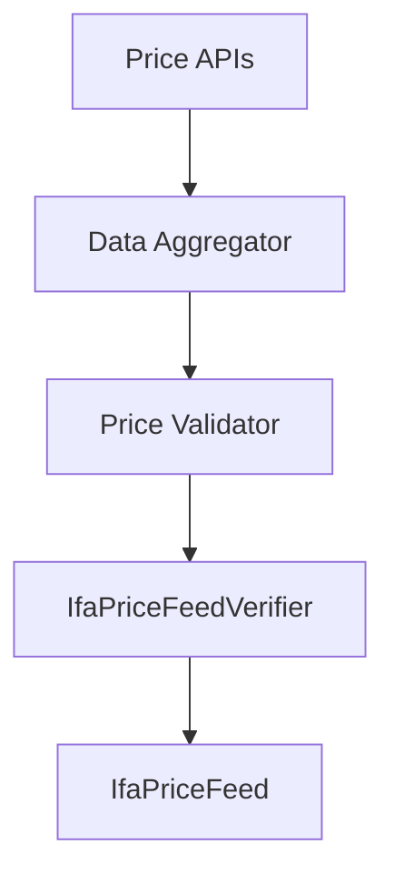

# Integration Guide

Relayer infrastructure setup and integration patterns for the IFA Oracle Price Feed System.

## Relayer Architecture



## Basic Relayer Setup

### Requirements
- Node.js 18+
- Stable internet connection
- Funded wallet for gas fees

### Simple Relayer Implementation

```javascript
// relayer.js
const { ethers } = require('ethers');
const axios = require('axios');

class PriceFeedRelayer {
    constructor(config) {
        this.provider = new ethers.providers.JsonRpcProvider(config.rpcUrl);
        this.wallet = new ethers.Wallet(config.privateKey, this.provider);
        this.verifierContract = new ethers.Contract(
            config.verifierAddress,
            config.verifierAbi,
            this.wallet
        );
        this.updateInterval = 300000; // 5 minutes
        this.roundCounter = 1;
    }

    async start() {
        console.log('Starting relayer...');
        this.scheduleUpdates();
    }

    scheduleUpdates() {
        setInterval(async () => {
            try {
                await this.updatePrices();
            } catch (error) {
                console.error('Update failed:', error);
            }
        }, this.updateInterval);
    }

    async updatePrices() {
        const priceData = await this.fetchPrices();
        if (priceData.length > 0) {
            await this.submitPrices(priceData);
            this.roundCounter++;
        }
    }

    async fetchPrices() {
        // Fetch from your preferred price API
        const response = await axios.get('https://api.coingecko.com/api/v3/simple/price?ids=usd-coin,tether&vs_currencies=usd');
        
        return [
            {
                symbol: 'USDC',
                price: Math.floor(response.data['usd-coin'].usd * 1e30), // 30 decimals
                timestamp: Date.now()
            },
            {
                symbol: 'USDT', 
                price: Math.floor(response.data.tether.usd * 1e30),
                timestamp: Date.now()
            }
        ];
    }

    async submitPrices(priceData) {
        const assetIds = priceData.map(data => 
            ethers.utils.keccak256(ethers.utils.toUtf8Bytes(data.symbol))
        );
        
        const priceFeeds = priceData.map(data => ({
            decimal: 0, // Stored with 30 decimals
            lastUpdateTime: Math.floor(Date.now() / 1000),
            price: data.price,
            roundId: this.roundCounter
        }));

        const tx = await this.verifierContract.submitPriceFeed(
            assetIds,
            priceFeeds,
            { gasLimit: 500000 }
        );
        
        await tx.wait();
        console.log('Prices submitted:', tx.hash);
    }
}

// Usage
const relayer = new PriceFeedRelayer({
    rpcUrl: process.env.RPC_URL,
    privateKey: process.env.PRIVATE_KEY,
    verifierAddress: process.env.VERIFIER_ADDRESS,
    verifierAbi: [/* ABI here */]
});

relayer.start();
```

## DApp Integration Patterns

### Basic Price Query

```solidity
contract MyDApp {
    IIfaPriceFeed public oracle;
    
    constructor(address _oracle) {
        oracle = IIfaPriceFeed(_oracle);
    }
    
    function getAssetPrice(string memory asset) external view returns (uint256) {
        bytes32 assetId = keccak256(bytes(asset));
        (IIfaPriceFeed.PriceFeed memory price, bool exists) = oracle.getAssetInfo(assetId);
        
        require(exists, "Price not available");
        require(block.timestamp - price.lastUpdateTime < 3600, "Price stale");
        
        return price.price;
    }
    
    function getExchangeRate(string memory from, string memory to) external view returns (uint256) {
        bytes32 fromId = keccak256(bytes(from));
        bytes32 toId = keccak256(bytes(to));
        
        IIfaPriceFeed.DerviedPair memory pair = oracle.getPairById(fromId, toId);
        return pair.derivedPrice;
    }
}
```

### Batch Price Operations

```solidity
contract BatchPriceConsumer {
    IIfaPriceFeed public oracle;
    
    function getBatchPrices(string[] calldata assets) external view returns (uint256[] memory prices) {
        bytes32[] memory assetIds = new bytes32[](assets.length);
        for (uint i = 0; i < assets.length; i++) {
            assetIds[i] = keccak256(bytes(assets[i]));
        }
        
        (IIfaPriceFeed.PriceFeed[] memory priceFeeds, bool[] memory exists) = 
            oracle.getAssetsInfo(assetIds);
            
        prices = new uint256[](assets.length);
        for (uint i = 0; i < assets.length; i++) {
            require(exists[i], "Price not available");
            prices[i] = priceFeeds[i].price;
        }
    }
}
```

## Production Setup

### Environment Configuration

```bash
# .env
RPC_URL=https://mainnet.base.org
PRIVATE_KEY=your_relayer_private_key
VERIFIER_ADDRESS=0x...
PRICE_FEED_ADDRESS=0x...

# Monitoring
DISCORD_WEBHOOK=https://discord.com/api/webhooks/...
TELEGRAM_BOT_TOKEN=your_bot_token
TELEGRAM_CHAT_ID=your_chat_id
```

### Monitoring & Alerts

```javascript
class MonitoringService {
    constructor(config) {
        this.webhookUrl = config.discordWebhook;
    }
    
    async alert(message, severity = 'info') {
        const payload = {
            content: `[${severity.toUpperCase()}] ${message}`,
            username: 'Oracle Relayer'
        };
        
        await axios.post(this.webhookUrl, payload);
    }
    
    async priceUpdateAlert(assets, txHash) {
        await this.alert(
            `Price update successful for ${assets.join(', ')}. Tx: ${txHash}`,
            'info'
        );
    }
    
    async errorAlert(error) {
        await this.alert(`Error: ${error.message}`, 'error');
    }
}
```

### Error Handling & Retry Logic

```javascript
class RobustRelayer extends PriceFeedRelayer {
    constructor(config) {
        super(config);
        this.maxRetries = 3;
        this.retryDelay = 5000; // 5 seconds
    }
    
    async submitPricesWithRetry(priceData) {
        for (let attempt = 1; attempt <= this.maxRetries; attempt++) {
            try {
                await this.submitPrices(priceData);
                return;
            } catch (error) {
                console.log(`Attempt ${attempt} failed:`, error.message);
                
                if (attempt === this.maxRetries) {
                    throw error;
                }
                
                await new Promise(resolve => setTimeout(resolve, this.retryDelay));
            }
        }
    }
}
```

## Security Best Practices

### Key Management
- Use hardware wallets or secure key management systems
- Rotate keys regularly
- Monitor relayer account balance and activity

### Access Control
- Whitelist relayer addresses in verifier contract
- Implement multi-signature for critical operations
- Regular security audits

### Data Validation
- Validate price ranges and outliers
- Cross-reference multiple data sources
- Implement circuit breakers for anomalous data 